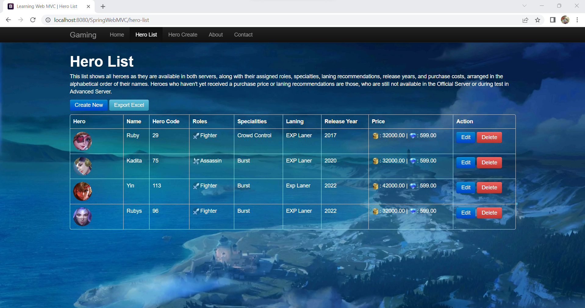
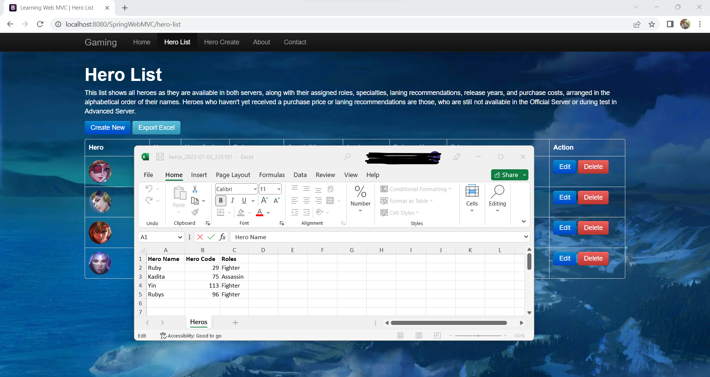
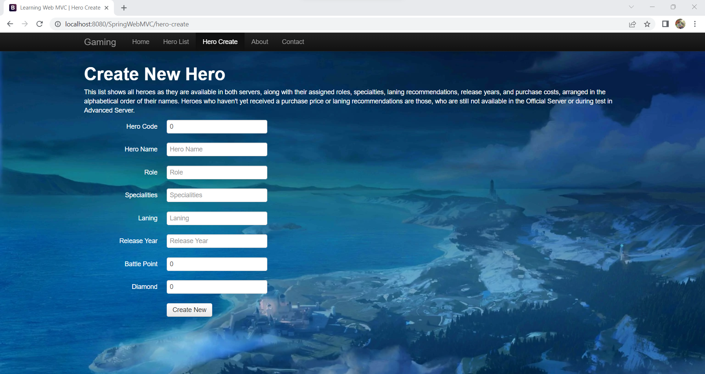
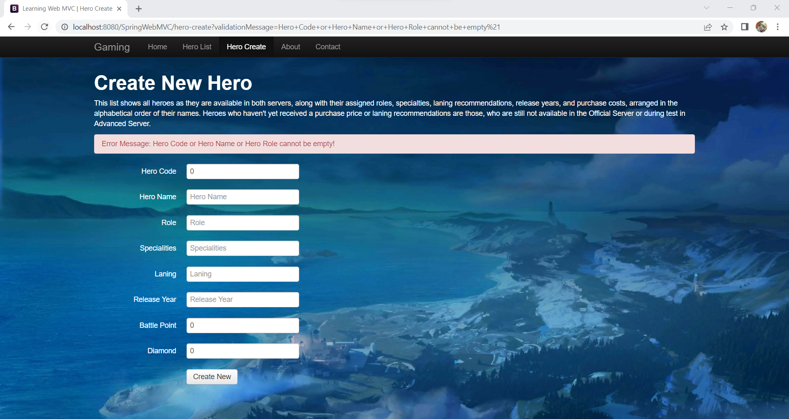
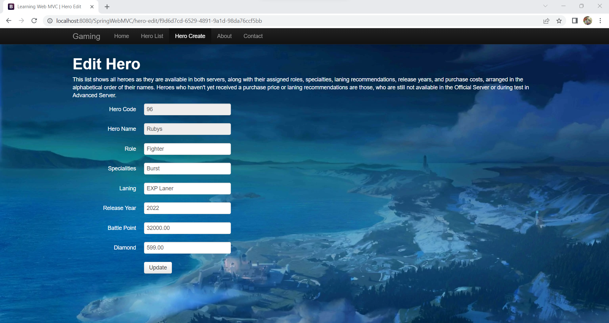
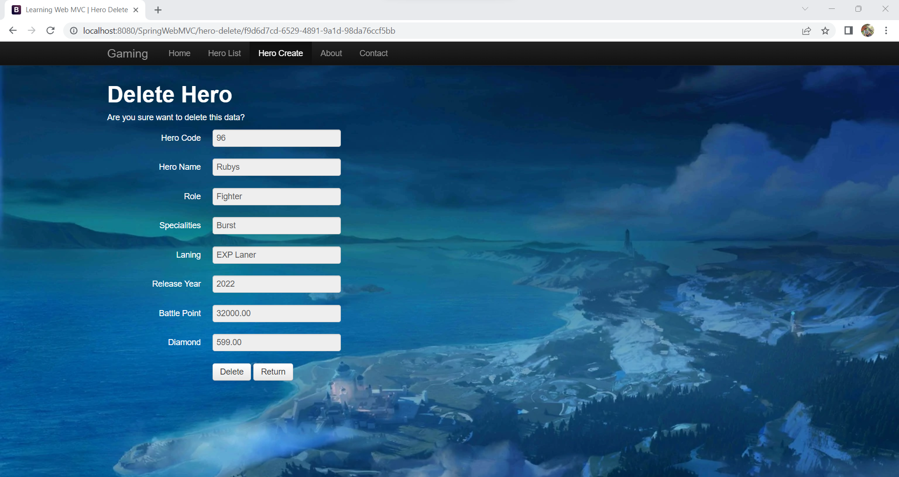

## Simple CRUD Spring MVC + Hibernate + PostgreSQL + Maven + Bootstrap
* Project name : SpringWebMVC
* JDK Runtime : 1.7.0_80
* Web Server : Apache Tomcat 8.5.0
* Database : PostgreSQL 13.11
* Library : Spring Framework, Hibernate ORM, Joda Time, Servlet API 2.5, Encryptable Properties
* Dependency Management : Maven
* Front End : Bootstrap 2.3.2 Framework

### Output:

* List View 

* Export to excel

* Create

* Create validation

* Edit

* Delete

Best Regards, 
Thank you.
